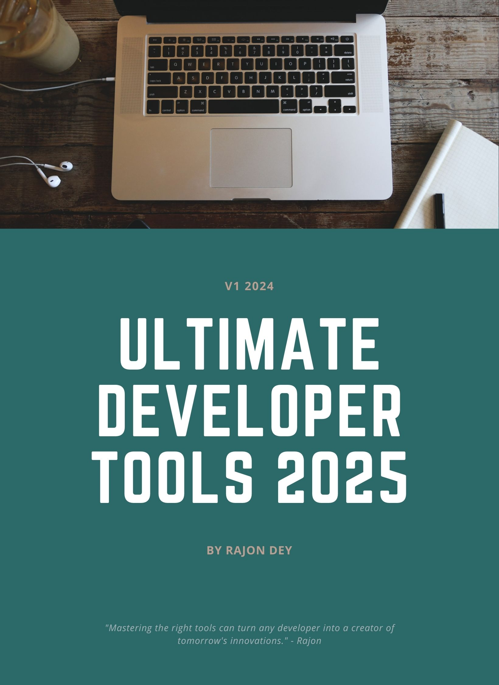

# Ultimate Developer Tools

Welcome to the ultimate collection of cutting-edge developer tools!

This list is regularly updated to reflect the latest advancements in dev tools that are shaping the future of software development.

## Key Features:

- Ranked from Best to Good
- Regularly updated
- Covers diverse dev needs
- Links to official sites

Empower developers with a reliable, current resource to stay at the forefront of technology.

Explore, experiment, and elevate your coding game!

Let's build the future together.
If you find this resource helpful, please ⭐ the repo.

---

# 🛠️ Ultimate Developer Tools Collection 2024

1. 🤖 AI Tools
2. 📝 Code Editors
3. 📚 Version Control
4. 🔄 CI/CD
5. ☁️ Cloud Platforms
6. 🔒 Security
7. 🗄️ Database Tech
8. 🔌 APIs
9. 📖 Documentation
10. 🧩 VS Code Extensions
11. 🎨 CSS Generators
12. 🖼️ Vector Media
13. 🏷️ Icons
14. 🎭 Animation Libraries
15. 🔗 Blockchain Development
16. 📋 Cheatsheets
17. 🧩 Code Snippets
18. 🏠 Hosting
19. 🧭 Chrome Extensions
20. 🛒 Software Marketplaces

---

## 🛠️ Ultimate Developer Tools Collection 2024

  
<h3>🤖 AI Tools</h3>

1. [**GitHub Copilot**](https://github.com/features/copilot) - AI-powered code completion
2. [**ChatGPT**](https://chat.openai.com/) - Versatile AI coding assistant
3. [**OpenAI API**](https://openai.com/api/) - Integrate AI into applications
4. [**Google Bard**](https://bard.google.com/) - AI for coding ideas
5. [**Claude**](https://www.anthropic.com/) - Advanced AI for complex tasks
6. [Amazon CodeWhisperer](https://aws.amazon.com/codewhisperer/) - AWS-focused AI code generator
7. [Tabnine](https://www.tabnine.com/) - Personalized code completion
8. [DeepMind AlphaCode](https://alphacode.deepmind.com/) - AI for complex programming
9. [IBM Watson Studio](https://www.ibm.com/cloud/watson-studio) - Comprehensive AI development platform
10. [Hugging Face Transformers](https://huggingface.co/transformers/) - Open-source ML models

  
<h3>📝 Code Editors</h3>

1. [**Visual Studio Code**](https://code.visualstudio.com/) - Versatile, extensible editor
2. [**JetBrains IDEs**](https://www.jetbrains.com/) - Language-specific professional IDEs
3. [Sublime Text](https://www.sublimetext.com/) - Fast, lightweight text editor
4. [Vim](https://www.vim.org/) - Highly configurable terminal editor
5. [Atom](https://atom.io/) - Hackable text editor

  
<h3>📚 Version Control</h3>

1. [**Git**](https://git-scm.com/) - Distributed version control system
2. [**GitHub**](https://github.com/) - Git repository hosting and collaboration
3. [**GitLab**](https://about.gitlab.com/) - DevOps platform with Git repository
4. [Bitbucket](https://bitbucket.org/) - Git and Mercurial code management

  
<h3>🔄 CI/CD</h3>

1. [**Jenkins**](https://www.jenkins.io/) - Extensible automation server
2. [**GitLab CI/CD**](https://docs.gitlab.com/ee/ci/) - Integrated CI/CD in GitLab
3. [**GitHub Actions**](https://github.com/features/actions) - CI/CD integrated with GitHub
4. [CircleCI](https://circleci.com/) - Cloud-native CI/CD platform
5. [Travis CI](https://travis-ci.org/) - Distributed CI for open source
6. [Azure DevOps](https://azure.microsoft.com/en-us/services/devops/) - Microsoft's end-to-end DevOps solution
7. [TeamCity](https://www.jetbrains.com/teamcity/) - Powerful CI/CD by JetBrains

  
<h3>☁️ Cloud Platforms</h3>

1. [**Amazon Web Services (AWS)**](https://aws.amazon.com/) - Comprehensive cloud computing platform
2. [**Microsoft Azure**](https://azure.microsoft.com/) - Cloud services for building, testing, deploying, and managing applications
3. [**Google Cloud Platform (GCP)**](https://cloud.google.com/) - Suite of cloud computing services
4. [DigitalOcean](https://www.digitalocean.com/) - Cloud infrastructure provider focused on simplicity
5. [Heroku](https://www.heroku.com/) - Platform as a Service (PaaS) for easy application deployment
6. [IBM Cloud](https://www.ibm.com/cloud) - Enterprise-grade cloud computing solutions
7. [Oracle Cloud](https://www.oracle.com/cloud/) - Comprehensive set of cloud solutions
8. [Alibaba Cloud](https://www.alibabacloud.com/) - Leading cloud provider in Asia

  
<h3>🔒 Security</h3>

1. [**OWASP**](https://owasp.org/) - Open source security community and resources
2. [**Snyk**](https://snyk.io/) - Developer-first security platform
3. [**SonarQube**](https://www.sonarqube.org/) - Code quality and security static analysis
4. [Burp Suite](https://portswigger.net/burp) - Web application security testing
5. [Acunetix](https://www.acunetix.com/) - Web application security scanner
6. [Veracode](https://www.veracode.com/) - Application security testing platform
7. [HackerOne](https://www.hackerone.com/) - Bug bounty and vulnerability coordination platform

  
<h3>🗄️ Database Tech</h3>

1. [**PostgreSQL**](https://www.postgresql.org/) - Advanced open-source relational database
2. [**MySQL**](https://www.mysql.com/) - Popular open-source relational database
3. [**MongoDB**](https://www.mongodb.com/) - Document-oriented NoSQL database
4. [Redis](https://redis.io/) - In-memory data structure store
5. [Elasticsearch](https://www.elastic.co/elasticsearch/) - Distributed search and analytics engine
6. [Cassandra](https://cassandra.apache.org/) - Highly scalable NoSQL database
7. [SQLite](https://www.sqlite.org/) - Lightweight, serverless relational database
8. [Oracle Database](https://www.oracle.com/database/) - Enterprise-grade relational database
9. [Microsoft SQL Server](https://www.microsoft.com/en-us/sql-server/) - Relational database management system
10. [Neo4j](https://neo4j.com/) - Graph database platform
11. [Couchbase](https://www.couchbase.com/) - Distributed NoSQL cloud database
12. [InfluxDB](https://www.influxdata.com/) - Time series database

  
<h3>🔌 APIs</h3>

1. [**Postman**](https://www.postman.com/) - API development and testing platform
2. [**Swagger/OpenAPI**](https://swagger.io/) - API documentation and design tools
3. [**GraphQL**](https://graphql.org/) - Query language for APIs
4. [REST](https://restfulapi.net/) - Representational State Transfer architectural style
5. [gRPC](https://grpc.io/) - High-performance RPC framework
6. [Apollo](https://www.apollographql.com/) - GraphQL implementation platform
7. [Insomnia](https://insomnia.rest/) - API client and design platform
8. [API Gateway (AWS/Azure/GCP)](https://aws.amazon.com/api-gateway/) - Managed API management services
9. [FastAPI](https://fastapi.tiangolo.com/) - Modern Python web framework for building APIs
10. [JSON:API](https://jsonapi.org/) - Specification for building APIs in JSON

  
<h3>📖 Documentation</h3>

1. [**Notion**](https://www.notion.so/) - All-in-one workspace for notes, docs, and collaboration
2. [**Markdown**](https://www.markdownguide.org/) - Lightweight markup language for creating formatted text
3. [**Read the Docs**](https://readthedocs.org/) - Documentation hosting platform
4. [GitBook](https://www.gitbook.com/) - Modern documentation platform
5. [Confluence](https://www.atlassian.com/software/confluence) - Team workspace for documentation and collaboration
6. [Sphinx](https://www.sphinx-doc.org/) - Documentation generator, especially popular in Python community
7. [Swagger UI](https://swagger.io/tools/swagger-ui/) - Interactive API documentation

  
<h3>🧩 VS Code Extensions</h3>

1. [**IntelliCode**](https://marketplace.visualstudio.com/items?itemName=VisualStudioExptTeam.vscodeintellicode) - AI-assisted development
2. [**Prettier**](https://marketplace.visualstudio.com/items?itemName=esbenp.prettier-vscode) - Code formatter
3. [**ESLint**](https://marketplace.visualstudio.com/items?itemName=dbaeumer.vscode-eslint) - JavaScript linter
4. [GitLens](https://marketplace.visualstudio.com/items?itemName=eamodio.gitlens) - Git supercharged
5. [Live Share](https://marketplace.visualstudio.com/items?itemName=MS-vsliveshare.vsliveshare) - Real-time collaboration
6. [Docker](https://marketplace.visualstudio.com/items?itemName=ms-azuretools.vscode-docker) - Docker support
7. [Python](https://marketplace.visualstudio.com/items?itemName=ms-python.python) - Python language support
8. [REST Client](https://marketplace.visualstudio.com/items?itemName=humao.rest-client) - REST API testing tool
9. [CodeSnap](https://marketplace.visualstudio.com/items?itemName=adpyke.codesnap) - Take beautiful screenshots of your code
10. [CSS Formatter](https://marketplace.visualstudio.com/items?itemName=aeschli.vscode-css-formatter) - CSS, SCSS, Less formatter
11. [ES7+ React/Redux/React-Native snippets](https://marketplace.visualstudio.com/items?itemName=dsznajder.es7-react-js-snippets) - JavaScript and React/Redux snippets
12. [indent-rainbow](https://marketplace.visualstudio.com/items?itemName=oderwat.indent-rainbow) - Makes indentation easier to read
13. [Markdown All in One](https://marketplace.visualstudio.com/items?itemName=yzhang.markdown-all-in-one) - All you need to write Markdown
14. [Material Icon Theme](https://marketplace.visualstudio.com/items?itemName=PKief.material-icon-theme) - Material Design Icons for Visual Studio Code
15. [Turbo Console Log](https://marketplace.visualstudio.com/items?itemName=ChakrounAnas.turbo-console-log) - Automating the process of writing meaningful log messages
16. [vscode-icons](https://marketplace.visualstudio.com/items?itemName=vscode-icons-team.vscode-icons) - Icons for Visual Studio Code

  
<h3>🎨 CSS Generators</h3>

1. [**CSS Gradient Generator**](https://cssgradient.io/) - Create and customize gradients
2. [**Flexbox Generator**](https://loading.io/flexbox/) - Visual tool for creating Flexbox layouts
3. [**CSS Grid Generator**](https://cssgrid-generator.netlify.app/) - Visual tool for creating CSS Grid layouts
4. [Keyframes](https://keyframes.app/) - Browser-based, visual CSS animation creator
5. [Blobmaker](https://www.blobmaker.app/) - Generate organic SVG shapes
6. [Neumorphism.io](https://neumorphism.io/#e0e0e0) - Generate soft UI CSS code
7. [Best CSS Button Generator](https://www.bestcssbuttongenerator.com/) - Create custom CSS buttons
8. [BGJar](https://bgjar.com/) - Generate beautiful background patterns
9. [CSS Clip-path Maker](https://bennettfeely.com/clippy/) - Create complex shapes using clip-path
10. [CSS Box Shadow Generator](https://cssgenerator.org/box-shadow-css-generator.html) - Generate box shadows
11. [CSS Animation Generator](https://animista.net/) - Create custom CSS animations

  
<h3>🖼️ Vector Media</h3>

<h4>📸 Images:</h4>

1. [**Unsplash**](https://unsplash.com/) - Beautiful free images & pictures
2. [**Pexels**](https://www.pexels.com/) - Free stock photos & videos
3. [Pixabay](https://pixabay.com/) - Free images & royalty-free stock
4. [Freepik](https://www.freepik.com/) - Graphic resources for everyone

<h4>🎞️ Videos:</h4>

1. [**Pexels Videos**](https://www.pexels.com/videos/) - Free stock videos
2. [**Videvo**](https://www.videvo.net/) - Free stock footage & motion graphics
3. [Pixabay Videos](https://pixabay.com/videos/) - Free stock video footage

<h4>🔣 Icons:</h4>

1. [**Flaticon**](https://www.flaticon.com/) - The largest database of free icons
2. [**Iconscout**](https://iconscout.com/) - Free Download Icons, Illustrations, and Stock Photos
3. [SVG Repo](https://www.svgrepo.com/) - Free SVG Vectors and Icons
4. [Iconfinder](https://www.iconfinder.com/) - Icons, illustrations, and stock photos

<h4>🖋️ Vector Illustrations:</h4>

1. [**Undraw**](https://undraw.co/illustrations) - Open-source illustrations for any idea
2. [**Storyset**](https://storyset.com/) - Editable illustrations for your next project
3. [Vecteezy](https://www.vecteezy.com/) - Free vector art, stock photos & videos
4. [Drawkit](https://www.drawkit.io/) - Beautiful, free illustrations
5. [Humaaans](https://www.humaaans.com/) - Mix-and-match illustrations of people
6. [Artify Illustrations](https://www.artify.co/illustrations-figma) - Illustrations for Figma

  
<h3>🏷️ Icons</h3>

1. [**Font Awesome**](https://fontawesome.com/) - Vector icons and social logos
2. [**Material Icons**](https://material.io/resources/icons/) - Google's Material Design icons
3. [**Feather Icons**](https://feathericons.com/) - Simply beautiful open source icons
4. [Ionicons](https://ionicons.com/) - Premium designed icons for use in web, iOS, Android, and desktop apps
5. [Heroicons](https://heroicons.com/) - Beautiful hand-crafted SVG icons, by the makers of Tailwind CSS
6. [Flaticon](https://www.flaticon.com/) - The largest database of free icons
7. [Iconscout](https://iconscout.com/) - Free Download Icons, Illustrations, and Stock Photos
8. [The Noun Project](https://thenounproject.com/) - Icons and photos for everything
9. [Remix Icon](https://remixicon.com/) - Open source icon library
10. [Tabler Icons](https://tabler-icons.io/) - Over 1950 free MIT-licensed high-quality SVG icons
11. [Simple Icons](https://simpleicons.org/) - Free SVG icons for popular brands
12. [Iconify](https://iconify.design/) - All popular icon sets, one framework

  
<h3>🎭 Animation Libraries</h3>

1. [**GSAP (GreenSock Animation Platform)**](https://greensock.com/gsap/) - Professional-grade JavaScript animation for the modern web
2. [**Anime.js**](https://animejs.com/) - A lightweight JavaScript animation library
3. [**Three.js**](https://threejs.org/) - 3D library for JavaScript
4. [Motion One](https://motion.dev/) - A new animation library, built on the Web Animations API
5. [AOS (Animate On Scroll)](https://michalsnik.github.io/aos/) - Animate elements as you scroll down, and up
6. [Popmotion](https://popmotion.io/) - Simple animation libraries for delightful user interfaces
7. [Vivus](https://maxwellito.github.io/vivus/) - JavaScript library to make drawing animation on SVG
8. [Mo.js](https://mojs.github.io/) - Motion graphics toolbelt for the web
9. [Typed.js](https://mattboldt.com/demos/typed-js/) - A JavaScript Typing Animation Library
10. [ScrollReveal](https://scrollrevealjs.org/) - Easy scroll animations for web and mobile browsers
11. [Barba.js](https://barba.js.org/) - Create fluid and smooth transitions between your website's pages

  
<h3>🔗 Blockchain Development</h3>

1. [**Ethereum**](https://ethereum.org/) - Decentralized platform for applications
    - [Solidity](https://docs.soliditylang.org/) - Contract-oriented programming language
    - [Web3.js](https://web3js.readthedocs.io/) - Ethereum JavaScript API
    - [Truffle](https://www.trufflesuite.com/) - Development environment, testing framework and asset pipeline
2. [**Hyperledger**](https://www.hyperledger.org/) - Open source blockchain technologies
3. [**Corda**](https://www.corda.net/) - Open source blockchain platform for business
4. [Binance Smart Chain](https://www.binance.org/en/smartChain) - Blockchain network for running smart contract-based applications
5. [Polkadot](https://polkadot.network/) - Multi-chain network for customized side-chains
6. [EOSIO](https://eos.io/) - Blockchain protocol powered by the native cryptocurrency EOS
7. [Stellar](https://www.stellar.org/) - Open network for storing and moving money
8. [Cardano](https://cardano.org/) - Blockchain platform for changemakers, innovators, and visionaries
9. [Tezos](https://tezos.com/) - Self-amending blockchain network

<h4>Development Tools:</h4>

- [Remix](https://remix.ethereum.org/) - Browser-based IDE for Solidity
- [Ganache](https://www.trufflesuite.com/ganache) - Personal blockchain for Ethereum development
- [MetaMask](https://metamask.io/) - Crypto wallet & gateway to blockchain apps
- [Hardhat](https://hardhat.org/) - Ethereum development environment for professionals

  
<h3>📋 Cheatsheets</h3>

1. [**OverAPI**](https://overapi.com/) - Collecting all cheat sheets
2. [**HTML Cheatsheet**](https://htmlcheatsheet.com/) - Interactive HTML cheat sheet
3. [**CSS Cheatsheet**](https://htmlcheatsheet.com/css/) - Interactive CSS cheat sheet
4. [JavaScript Cheatsheet](https://htmlcheatsheet.com/js/) - Interactive JavaScript cheat sheet
5. [Git Cheatsheet](https://education.github.com/git-cheat-sheet-education.pdf) - GitHub's Git cheat sheet
6. [React Cheatsheet](https://reactcheatsheet.com/) - React cheat sheet with search
7. [Vue.js Cheatsheet](https://vue-cheatsheet.themeselection.com/) - Vue.js cheat sheet
8. [Python Cheatsheet](https://www.pythoncheatsheet.org/) - Comprehensive Python cheatsheet
9. [SQL Cheatsheet](https://www.sqltutorial.org/sql-cheat-sheet/) - SQL cheat sheet
10. [Markdown Cheatsheet](https://github.com/adam-p/markdown-here/wiki/Markdown-Cheatsheet) - Markdown cheat sheet
11. [Flexbox Cheatsheet](https://yoksel.github.io/flex-cheatsheet/) - Flexbox cheat sheet
12. [Grid Cheatsheet](https://grid.malven.co/) - CSS Grid cheat sheet
13. [Vim Cheatsheet](https://vim.rtorr.com/) - Vim cheat sheet
14. [Docker Cheatsheet](https://www.docker.com/sites/default/files/d8/2019-09/docker-cheat-sheet.pdf) - Docker cheat sheet

  
<h3>🧩 Code Snippets</h3>

1. [**GitHub Gists**](https://gist.github.com/) - Share your code snippets with others
2. [**CodePen**](https://codepen.io/) - Social development environment for front-end designers and developers
3. [**JSFiddle**](https://jsfiddle.net/) - Online editor for web snippets (HTML, CSS, JavaScript)
4. [LeetCode Discuss](https://leetcode.com/discuss/) - Community-driven platform to share coding solutions and discuss problems
5. [Carbon](https://carbon.now.sh/) - Create beautiful images of your source code to share on social media or blogs
6. [Repl.it](https://replit.com/~) - Collaborative browser-based IDE that supports multiple languages
7. [Ray.so](https://ray.so/) – Turn your code into beautiful images ready to share on social media platforms

  
<h3>🏠 Hosting</h3>

### Shared Hosting

Shared hosting is where multiple websites share resources on a single server. It's cost-effective and suitable for small websites or beginners.

1. [**Bluehost**](https://www.bluehost.com/) - Popular, WordPress-recommended hosting
2. [**SiteGround**](https://www.siteground.com/) - Fast, secure hosting with great support
3. [**Hostinger**](https://www.hostinger.com/) - Affordable hosting with good performance
4. [HostGator](https://www.hostgator.com/) - User-friendly hosting for various needs
5. [DreamHost](https://www.dreamhost.com/) - Reliable hosting with privacy focus

### Cloud Hosting

Cloud hosting uses a network of connected virtual and physical servers, offering scalability and reliability. Ideal for websites with varying traffic levels.

1. [**Amazon Web Services (AWS)**](https://aws.amazon.com/) - Comprehensive cloud services
2. [**Google Cloud Platform (GCP)**](https://cloud.google.com/) - Scalable cloud solutions
3. [**Microsoft Azure**](https://azure.microsoft.com/) - Enterprise-grade cloud computing
4. [DigitalOcean](https://www.digitalocean.com/) - Developer-friendly cloud platform
5. [Linode](https://www.linode.com/) - High-performance SSD Linux servers

### Managed WordPress Hosting

Specialized hosting optimized for WordPress sites, offering enhanced security, performance, and WordPress-specific support.

1. [**WP Engine**](https://wpengine.com/) - Premium managed WordPress hosting
2. [Kinsta](https://kinsta.com/) - Managed WordPress hosting powered by Google Cloud
3. [Flywheel](https://getflywheel.com/) - WordPress hosting for designers and agencies

### Static Site Hosting

Hosting for websites with fixed content, typically built with static site generators. Offers fast loading times and enhanced security.

1. [Netlify](https://www.netlify.com/) - Modern static website hosting and automation
2. [Vercel](https://vercel.com/) - Hosting for JAMstack and serverless deployment
3. [GitHub Pages](https://pages.github.com/) - Free hosting directly from your GitHub repo

### Platform as a Service (PaaS)

PaaS provides a platform for developers to build, run, and manage applications without the complexity of maintaining the infrastructure.

1. [Heroku](https://www.heroku.com/) - Container-based cloud platform
2. [Platform.sh](https://platform.sh/) - PaaS for agile development and deployment

### Domain Registrars (often bundled with hosting)

1. [Namecheap](https://www.namecheap.com/) - Domain registration and web hosting
2. [Google Domains](https://domains.google/) - Domain registration service by Google

### VPS & Dedicated Servers

Virtual Private Servers (VPS) and Dedicated Servers offer more control and resources, suitable for larger websites or applications requiring specific configurations.

1. [Vultr](https://www.vultr.com/) - High-performance SSD cloud instances
2. [OVHcloud](https://www.ovhcloud.com/) - European cloud and dedicated server provider

  
<h3>🧭 Chrome Extensions</h3>

1. [**Web Developer**](https://chrome.google.com/webstore/detail/web-developer/bfbameneiokkgbdmiekhjnmfkcnldhhm) - Adds a toolbar with various web development tools.
2. [**Lighthouse**](https://chrome.google.com/webstore/detail/lighthouse/blipmdconlkpinefehnmjammfjpmpbjk) - Automated tool for improving web page quality.
3. [**JSON Formatter**](https://chrome.google.com/webstore/detail/json-formatter/bcjindcccaagfpapjjmafapmmgkkhgoa) - Makes JSON easy to read.
4. [React Developer Tools](https://chrome.google.com/webstore/detail/react-developer-tools/fmkadmapgofadopljbjfkapdkoienihi) - Adds React debugging tools to Chrome DevTools.
5. [Vue.js devtools](https://chrome.google.com/webstore/detail/vuejs-devtools/nhdogjmejiglipccpnnnanhbledajbpd) - Adds Vue.js debugging tools to Chrome DevTools.
6. [Wappalyzer](https://chrome.google.com/webstore/detail/wappalyzer/gppongmhjkpfnbhagpmjfkannfbllamg) - Identifies web technologies used on websites.
7. [ColorZilla](https://chrome.google.com/webstore/detail/colorzilla/bhlhnicpbhignbdhedgjhgdocnmhomnp) - Color picker and eyedropper tool.
8. [CSS Peeper](https://chrome.google.com/webstore/detail/css-peeper/mbnbehikldjhnfehhnaidhjhoofhpehk) - Extract CSS and build beautiful styleguides.
9. [Clear Cache](https://chrome.google.com/webstore/detail/clear-cache/cppjkneekbjaeellbfkmgnhonkkjfpdn) - Clear your cache and browsing data with a single click.
10. [WhatFont](https://chrome.google.com/webstore/detail/whatfont/jabopobgcpjmedljpbcaablpmlmfcogm) - The easiest way to identify fonts on web pages.
11. [Locator JS](https://chrome.google.com/webstore/detail/locatorjs/npbfdllefekhdplbkdigpncggmojpefi) - Quickly locate the source of JS errors and console.logs in your source code.

  
<h3>🛒 Software Marketplaces</h3>

1. [**GitHub Marketplace**](https://github.com/marketplace) - Apps and actions to customize your GitHub workflow.
2. [**Visual Studio Marketplace**](https://marketplace.visualstudio.com/) - Extensions for Visual Studio, Azure DevOps Services, Azure DevOps Server and Visual Studio Code.
3. [**Envato Market**](https://themeforest.net/) - Includes ThemeForest and CodeCanyon for WordPress themes, plugins, and more.
4. [Docker Hub](https://hub.docker.com/) - Container images for Docker.
5. [NPM](https://www.npmjs.com/) - JavaScript packages for Node.js.
6. [Atlassian Marketplace](https://marketplace.atlassian.com/) - Add-ons for Atlassian products like Jira and Confluence.
7. [AppSumo](https://appsumo.com/) - Marketplace for digital products and services, often offering lifetime deals on software tools.
8. [Product Hunt](https://www.producthunt.com/) - Platform for discovering and launching new tech products.

---

## Stay Connected

### 📬 Get the Ultimate Developer Tools eBook

Subscribe to my newsletter to receive the "Ultimate Developer Tools v1 2024" as a free PDF eBook, along with regular updates on new tools and development tips:

[Subscribe to the Newsletter](https://developer-data.beehiiv.com/subscribe)

### 🌐 Follow Me on Social Media

Stay updated with the latest in development tools and tech trends:

- [Twitter](https://twitter.com/rajjon_dey?utm_source=developer-data.beehiiv.com&utm_medium=newsletter&utm_campaign=new-post)
- [LinkedIn](https://www.linkedin.com/in/rajondey/?utm_source=developer-data.beehiiv.com&utm_medium=newsletter&utm_campaign=new-post)

### 📝 Read More of My Work

Find more of my articles and insights on development:

- [Medium](https://medium.com/@rajondeyofficial?utm_source=developer-data.beehiiv.com&utm_medium=newsletter&utm_campaign=new-post)
- [Dev.to](https://dev.to/rajondey?utm_source=developer-data.beehiiv.com&utm_medium=newsletter&utm_campaign=new-post)
- [Hashnode](https://hashnode.com/@rajondey?utm_source=developer-data.beehiiv.com&utm_medium=newsletter&utm_campaign=new-post)

---

## Conclusion

Thank you for exploring the "Ultimate Developer Tools v1 2024". We hope this curated list has inspired and enhanced your coding journey.

### Show Your Support

If you find this resource helpful, please consider giving it a star ⭐ on GitHub. Your support encourages us to keep improving and updating this collection.

### How to Contribute

We welcome contributions from the developer community! Before submitting new tools or suggestions, please read our [contributing guidelines](https://github.com/RajonDey/ultimate-developer-tools/blob/main/contribution.md). Your input helps make this resource even more valuable for developers worldwide.

### Get in Touch

Have questions, suggestions, or want to share your development experiences? Feel free to reach out:

📧 Email: hello@rajondey.com

Let's continue building the future of technology together! ✨

### License

This project is licensed under the MIT License. For more details, see the [LICENSE.md](https://github.com/RajonDey/ultimate-developer-tools/blob/main/LICENSE) file.

---

*"Ultimate Developer Tools v1 2024" - Empowering developers, one tool at a time.*
